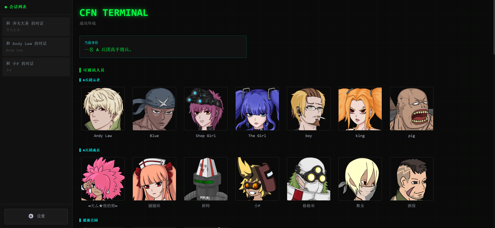

# CFN-RAG Backend（cfn-rag-backend）

[](https://opensource.org/licenses/MIT)

CFN-RAG 后端是一个面向 [Crazy Flash Night (CFN)](https://github.com/FlashNightModReborn/CrazyFlashNight) 的 **NPC 角色扮演对话 + 游戏数据 RAG + 任务生成/协商/写入Agent** 服务。它读取 CFN 的 `resources` 资源数据，通过检索增强生成（RAG）使得NPC能够理解游戏世界设定、角色背景、任务信息等内容，并通过一套“工具调用 + 校验管线 + 原子写入”的流程，在对话中生成可被游戏加载的委托任务（写入 `agent_tasks.json` / `agent_text.json`）。

前端终端界面为独立仓库：[cfn-terminal-web](https://github.com/aka-flashNight/cfn-terminal-web)。

## 预览



## 功能特点

- **RAG 检索智能对话**：基于游戏数据进行全面深度检索，进行关于角色、任务、物品等各类话题的对话
- **流式回复（SSE）**：支持流式输出，前端可做打字机效果
- **NPC 分层记忆系统**：按会话保存对话历史与摘要，保持上下文连贯
- **好感度 / 关系 / 情绪**：维护 NPC 独立状态，并支持工具化更新
- **多模态对话**：可注入 NPC 立绘/头像（WebP/PNG），增强角色扮演一致性
- **对话管理**：支持删除、重命名对话会话，分页加载历史记录
- **向量索引持久化**：本地持久化向量索引，二次启动可直接加载
- **Agent 任务生成系统（端到端）**：
  - 在对话中先生成 **任务草案（draft）**，并可多轮 **讨价还价/局部修改/重新发布或取消**
  - 用户确认后 **原子写入** CFN 任务文件（`agent_tasks.json` 与 `agent_text.json`）
  - 全流程带 **后端校验管线**（物品/关卡/进度/价值预算/等级匹配等）
- **离线/本地部署**：可本地运行，数据在本机处理
- **可执行文件打包发布**：提供 PyInstaller 打包的单文件版与完整独立版

## 前置要求

CFN-RAG 后端需要配合 **Crazy Flash Night 游戏资源** 使用。请将游戏项目的 `resources` 文件夹与本项目放在同一目录层级（或通过环境变量 `CFN_RESOURCES_DIR` 指定路径）：

```
父目录/
├── resources/              # Crazy Flash Night 游戏资源文件夹
│   ├── data/
│   └── ...
└── cfn-rag-backend/        # 本项目
    ├── launcher.py
    └── ...
```

Crazy Flash Night 游戏项目地址：`https://github.com/FlashNightModReborn/CrazyFlashNight`

## 架构概览（Decision → Execute → Generate）

为兼容部分 OpenAI-兼容模型在“工具调用 + 流式输出”上的限制，同时便于扩展更多工具，本项目的对话接口采用 **三阶段管线**：

- **Decision（非流式）**：LLM 仅负责判断是否需要工具，并产生 `tool_calls`
- **Execute（后端执行）**：后端分发工具调用，执行并把 `tool results` 注入消息
- **Generate（流式）**：LLM 生成最终 NPC 对话回复（SSE 流式输出）

该流程由 `services/agent_graph/` 下的 LangGraph 状态图实现，并设置工具回合上限（默认 5 轮）避免无限循环。

**代码入口（便于对照实现）**

| 职责 | 路径 |
|------|------|
| 图状态与编译 | `services/agent_graph/state.py`、`graph.py` |
| 各节点（准备 prompt、决策、工具、流式生成、后处理） | `services/agent_graph/nodes.py` |
| 分层 system/user prompt | `services/agent_graph/prompts.py` |
| OpenAI Function 工具 schema | `services/agent_tools/schemas.py` |
| `prepare_task_context` 数据筛选与组装 | `services/agent_tools/context_builder.py` |
| 全量/增量校验管线 | `services/agent_tools/validator.py` |
| 草案/确认/取消等工具逻辑与写入拼装 | `services/agent_tools/task_tools.py` |
| `tool_calls` 分发到上述实现 | `services/agent_tools/tool_executor.py` |
| 游戏数据内存 Registry | `services/game_data/registry.py` 及各 `*_registry.py` |
| 任务草案 SQLite（按 session） | `services/task_draft_store.py`（表 `session_task_drafts` 等） |

## 任务生成系统（草案 → 协商 → 写入）

### 硬约束：可写文件

**仅允许**后端修改以下两个文件（原子写入，避免半截 JSON）：

- `resources/data/task/agent_tasks.json`
- `resources/data/task/text/agent_text.json`

其余 `task/*.json`、`task/text/*.json`、物品/关卡等数据 **只读**，供检索与校验。

### 两步式 + 协商 + 确认

任务发布遵循“**两步式工具调用** + **校验** + **草案持久化** + **确认写入**”流程：

1. **准备上下文**：`prepare_task_context(task_type, reward_types)`  
   后端基于玩家进度/等级、NPC、商店/切磋能力等，从 `GameDataRegistry` 筛选关卡/物品/奖励候选与规则说明（详见 `data_files_overview.md`）。
2. **生成草案**：`draft_agent_task(...)`  
   LLM 输出结构化草案（`item_name`+`count` 等，由后端拼接为游戏所需的 `"物品名#数量"`），**全量校验**通过后按 `session_id` 写入 SQLite 草案表。
3. **协商修改**：`update_task_draft(draft_id, modify_fields)`  
   仅替换 `modify_fields` 中出现的顶层字段；后端对变更字段做**增量校验**（`task_type` / `get_requirements` 等不可通过此工具改类型时需重新走 1+2）。
4. **确认发布**：`confirm_agent_task(draft_id, description, get_dialogue, finish_dialogue, ...)`  
   合并任务说明与对话后再次校验，通过后分配任务 ID，并写入上述两个 agent 文件。
5. **取消**：`cancel_agent_task(draft_id, ...)`

辅助工具：**`search_knowledge`**（RAG 检索）、**`update_npc_mood`**（好感/情绪）。部分工具支持可选 **`ui_hint`（≤12 字）** 供前端/SSE 展示进度提示。

### `task_type` 枚举（12 种）

与 `services/agent_tools/schemas.py` 中 `TASK_TYPES` 一致：

`问候`、`传话`、`通关`、`清理`、`挑战`、`切磋`、`资源收集`、`装备缴纳`、`特殊物品获取`、`物品持有`、`通关并收集`、`通关并持有`。

### 校验管线（后端拦截范围摘要）

`services/agent_tools/validator.py` 对草案/更新/确认执行多项校验，主要包括：**物品是否存在**、**数量是否合理**、**关卡是否存在且解锁条件不超玩家进度**、**副本难度与 mercenary/challenge 规则**、**前置任务 ID 合法且禁止 `-1`**、**奖励总价值是否在预算区间**、**奖励类型与 NPC 商店/既有任务池等合规性**、**装备等级与当前阶段上限匹配**等。未通过时返回结构化错误，由模型修正后重试。
### Prompt 缓存命中优化

主流LLM API 服务会对「与历史请求相同前缀」的输入 token 计为 **缓存命中（Cached tokens）**，在控制台与账单中与未命中部分区分计价。

在本项目的一次典型「多轮工具 + 最终流式回复」链路中（以 Kimi K2.5 实测为例）实测：

| 阶段 | 缓存命中表现（示例） |
|------|----------------------|
| **工具决策轮** | 输入 token **命中率多在 95%+** |
| **最终生成轮** | 输入 token **命中率约 85%～95%** |


> 完整规则与字段说明见仓库根目录 `data_files_overview.md`。

## 快速开始

### 方式一：使用预编译的可执行文件（推荐有游戏项目或下载过一次独立版的用户）

1. 从 [Releases](https://github.com/aka-flashNight/cfn-rag-backend/releases) 页面下载 `CFN-RAG.exe`
2. 确保 `resources` 文件夹与 `CFN-RAG.exe` 在同一目录
3. 双击运行 `CFN-RAG.exe`
4. 浏览器将自动打开界面

**注意**：必须配合`resources`游戏项目文件夹，且是github上的最新版本


### 方式二：使用完整独立版（推荐无游戏项目且首次下载的用户）

适合没有下载游戏项目，但想体验功能的用户。

1. 从 [Releases](https://github.com/aka-flashNight/cfn-rag-backend/releases) 页面下载 `CFN-RAG-Full.zip`
2. 解压到任意位置
3. 双击运行 `CFN-RAG.exe`
4. 浏览器将自动打开界面

**优点**：无需额外下载游戏资源，独立运行
**注意**：内置资源可能不是最新版本

### 方式三：从源码运行（推荐开发者）

#### 环境要求

- Python 3.8+
- 足够的磁盘空间（约 500MB 用于依赖和模型）

#### 安装步骤

1. 克隆仓库

```bash
git clone https://github.com/aka-flashNight/cfn-rag-backend.git
cd cfn-rag-backend
```

2. 创建虚拟环境

```bash
python -m venv venv

# Windows
venv\Scripts\activate

# Linux/macOS
source venv/bin/activate
```

3. 安装依赖

```bash
pip install -r requirements.txt
```

4. 下载嵌入模型（可选，首次运行会自动下载）

```bash
# 使用国内镜像（推荐）
python scripts/download_model.py --modelscope

# 或使用 HuggingFace 镜像
python scripts/download_model.py --mirror

# 或使用代理
python scripts/download_model.py --proxy http://127.0.0.1:10809
```

5. tools 目录（可选，未随仓库提供）

本仓库**不包含** `tools` 目录（未上传至 GitHub）。仅当需要使用「从 SWF 导成立绘」功能时，需在项目根目录下创建 `tools` 文件夹并放入以下内容：

| 内容 | 说明 |
|------|------|
| **ffdec.jar** | 主程序。从 [JPEXS Free Flash Decompiler Releases](https://github.com/jindrapetrik/jpexs-decompiler/releases) 下载 `ffdec_*.zip`，解压后将其中的 `ffdec.jar` 或 `ffdec_<版本>.jar` 放入 `tools`（可重命名为 `ffdec.jar`） |
| **lib/** | 依赖库。官方 ZIP 内与 ffdec.jar 同级的 `lib` 文件夹**需一并**复制到 `tools` 下，保持 `tools/lib/` 与 `tools/ffdec.jar` 同级，否则 `java -jar` 无法解析 Class-Path |
| **运行环境** | 本机需安装 **JRE**，并将 `java` 加入 PATH 或配置 `JAVA_HOME` |

不需要此功能时可跳过。

6. 配置 API Key

复制 `.env` 文件并配置你的 API Key：

```bash
cp .env.example .env
# 编辑 .env 文件，填入你的 API Key
```

7. 启动服务

```bash
python launcher.py
```

## 发布版本说明

我们在 [Releases](https://github.com/aka-flashNight/cfn-rag-backend/releases) 页面提供以下两种发布包，请根据你的需求选择：

### 1. CFN-RAG-Full.zip（完整独立版）

**面向人群**：首次下载，想独立体验功能，不想下载完整游戏项目的用户

| 特点 | 说明 |
|------|------|
| 文件大小 | 约 400MB（含必要的资源文件） |
| 使用方式 | 解压到任意位置，进入文件夹运行 `CFN-RAG.exe` |
| 依赖 | 无需外部 `resources` 文件夹，无需 Python 环境 |
| 优点 | 完全独立运行，不依赖游戏项目 |
| 缺点 | 无法随游戏更新获取最新数据，仅包含基础资源 |

**目录结构**：
```
任意位置/
├── resources/                  # 包含必要的游戏数据文件
└── CFN-RAG.exe                 # 单文件可执行程序
```

---

### 2. CFN-RAG.exe（单文件版）

**面向人群**：有完整游戏项目，或已下载过完整版的用户

| 特点 | 说明 |
|------|------|
| 文件大小 | 约 300MB |
| 使用方式 | 将 `CFN-RAG.exe` 放到与 `resources` 文件夹同一目录，双击运行 |
| 依赖 | 需要游戏项目 `resources` 文件夹，无需 Python 环境 |
| 优点 | 单个文件，下载即用，移动方便 |
| 缺点 | 必须配合 `resources` 文件夹，且是github上的最新版本 |

**目录结构**：
```
你的游戏目录/
├── resources/              # 游戏资源文件夹
└── CFN-RAG.exe            # 单文件可执行程序
```

---

### 版本选择建议

| 你的情况 | 推荐版本 |
|---------|---------|
| 首次体验，没有游戏项目，想独立体验功能 | **CFN-RAG-Full.zip** |
| 有游戏项目，想体验完整功能/已下载过Full压缩包 | **CFN-RAG.exe** |
| 开发者，需要修改代码 | **源码克隆** |

## 配置说明

### 获取 API Key

本项目需要配置 LLM API Key 才能使用。以下是几种获取免费 API Key 的方式：

#### ModelScope 魔搭社区（国内访问稳定）

ModelScope 提供每日刷新的免费额度，单模型20~500 次，总共 2000 次，足以支持聊天体验。单个模型达到额度后可切换其他模型名称。

**获取步骤**：

1. **注册并绑定阿里云实名账户**
   - 访问 [ModelScope 官网](https://www.modelscope.cn/) 注册账号
   - 进入[账号绑定页面](https://www.modelscope.cn/my/settings/account)，绑定阿里云实名认证的账号（必须先完成阿里云实名认证）

2. **获取 API Key（访问令牌）**
   - 进入 [访问控制 - 访问令牌](https://modelscope.cn/my/access/token) 页面
   - 点击 "创建新的访问令牌"作为api_key

3. **选择模型并获取配置信息**
   - 进入 [模型库](https://www.modelscope.cn/models)
   - 在筛选条件中勾选 **"支持体验" → "推理 API-Inference"**，筛选出支持免费 API 调用的模型
   - 点击感兴趣的模型进入详情页
   - 在"推理 API" 或 "代码范例" 标签页中查看：
     - `model`：模型名称（如 `moonshotai/Kimi-K2.5`）
     - `base_url`：API Base地址（固定为 `https://api-inference.modelscope.cn/v1`）

**推荐模型**：
- `moonshotai/Kimi-K2.5`：Moonshot 的 Kimi K2.5 多模态模型，性能优秀，每日约50次免费调用次数（2026.3.11测试）
- `Qwen/Qwen3.5-397B-A17B`：阿里 Qwen3.5 多模态moe大模型，每日约100次免费调用次数（2026.3.11测试）
- `MiniMax/MiniMax-M2.5`：纯文本生成模型，每日约100次免费调用次数（2026.3.11测试）
- `ZhipuAI/GLM-5`：智谱文本生成模型，参数最大（但可能稍慢），每日约100次免费调用次数（2026.3.11测试）
- `deepseek-ai/DeepSeek-V3.2`：DeepSeek文本生成模型，参数大，每日约20次免费调用次数（2026.3.11测试）
- `Qwen/Qwen3.5-27B`：阿里 Qwen3.5 多模态模型，参数较小的版本，每日约**500**次免费调用次数（2026.3.11测试）
- `Qwen/Qwen3.5-122B-A10B`：阿里 Qwen3.5 多模态模型，参数中等的moe版本，每日约200次免费调用次数（2026.3.11测试）

**免费额度**：绑定阿里云实名账户后，每日 2000 次免费调用（单模型上限 500 次，但部分模型可能更少，达到上限后可更换模型）。

**配置示例**：
```env
LLM_API_KEY=your_modelscope_token_here
LLM_API_BASE=https://api-inference.modelscope.cn/v1
LLM_MODEL_NAME=moonshotai/Kimi-K2.5
```

#### Google Gemini（免费额度充足，需代理）

1. 访问 [Google AI Studio](https://aistudio.google.com/app/apikey)
2. 使用 Google 账号登录
3. 点击 "Create API Key"
4. 复制生成的 Key 到 `.env` 文件

**免费额度**：每分钟 60 次请求，完全满足个人使用需求。

**注意**：使用 Gemini 可能需要配置代理，请参考下方代理配置部分。

#### 其他推荐平台

- **[Moonshot AI](https://platform.moonshot.cn/)**：月之暗面 Kimi API，注册有15元免费额度
- **[QWEN](https://bailian.console.aliyun.com/cn-beijing/?tab=model#/api-key)**：阿里云百炼 QWEN API，每个模型百万token免费额度

### 配置文件说明

创建 `.env` 文件，参考以下配置：

```env
# LLM 配置（默认使用 Gemini）
LLM_API_KEY=your_api_key_here
LLM_API_BASE=https://generativelanguage.googleapis.com/v1beta/openai
LLM_MODEL_NAME=gemini-3.1-flash-lite-preview

# 或使用其他 OpenAI 兼容的 API
# LLM_API_BASE=https://api-inference.modelscope.cn/v1
# LLM_MODEL_NAME=Qwen/Qwen3.5-397B-A17B
```

### 代理配置

**如果你使用国外模型（如 Gemini、OpenAI）或开启了全局代理，需要在前端界面中配置代理。**

代理配置已集成到前端界面中，启动服务后，在前端界面的设置区域填写代理地址即可，例如：
- `http://127.0.0.1:7890`（Clash 默认端口）
- `http://127.0.0.1:10809`（v2rayN 默认端口）
- `http://127.0.0.1:1080`（Shadowsocks 默认端口）

配置后，代理会立即生效，对后续所有 LLM API 调用及网络请求生效。

### 立绘包（可选）

为获得更好的多模态对话体验，需要将 NPC 立绘放入 `resources/flashswf/portraits/illustration` 目录。支持以下三种方式：

#### 方式一：立绘拓展包 illustration.zip（推荐）

1. 下载立绘拓展包 **illustration.zip**
2. 将 **illustration.zip** 与 **CFN-RAG.exe** 放在**同一目录**
3. 启动程序后在页面上点击立绘生成，会自动解压到 `resources/flashswf/portraits/illustration`，无需 Java，解压很快

也可手动解压：将 zip 内的立绘图片（WebP 或 PNG）解压到 `resources/flashswf/portraits/illustration` 目录下。

#### 方式二：从 SWF 导成立绘（需 Java 与 tools）

若你有游戏资源中的 SWF 立绘（位于 `resources/flashswf/portraits/*.swf`），且本机已安装 **JRE**、项目 **tools** 目录下已放置 **ffdec.jar**（JPEXS FFDec 完整版），可在前端或通过接口触发「从 SWF 导成立绘」。导出结果为 **WebP** 格式（约 0.85 质量），约需数分钟，请耐心等待。

#### 方式三：自行准备图片

将立绘图片（WebP 或 PNG）直接放入 `resources/flashswf/portraits/illustration` 目录。

**文件命名与格式**：

| 项目 | 说明 |
|------|------|
| 文件名格式 | `{NPC名称}#{情绪}.webp`（推荐）或 `.png`，例如：`凯特#普通.webp`、`凯特#开心.webp` |
| 文件格式 | WebP（推荐，体积小）/ PNG（兼容） |
| 文件大小 | 建议控制在 1M 以内，过大的图片会消耗大量 Token |

**情绪标签**：需与 NPC 拥有的情绪一致；至少提供 `普通`，其余如 `微笑`、`严肃`、`悲伤`、`愤怒` 等按需制作。若请求的情绪无对应文件，会自动回退到 `普通`；若仍无立绘，会尝试使用 `profiles` 目录下的头像。

**目录结构示例**：
```
resources/
└── flashswf/
    └── portraits/
        ├── illustration/           # 立绘目录（zip 解压或 SWF 导出/手动放置）
        │   ├── Andy Law#普通.webp
        │   └── Andy Law#微笑.webp
        └── profiles/               # 头像目录（游戏自带）
            └── Andy Law.png
```

**说明**：立绘不是必须的，没有时对话功能仍可正常使用，仅多模态体验会降级为使用头像或纯文本。


## 项目结构

```
cfn-rag-backend/
├── api/                         # API 路由层
│   ├── assets_api.py
│   └── game_api.py
├── ai_engine/
│   └── game_data_loader.py      # 向量索引构建与缓存
├── core/
│   ├── config.py
│   └── exceptions.py
├── dist/                        # 前端构建产物（静态）
├── models/                      # 嵌入模型落盘目录（可选：首次运行或脚本下载后才有）
│   └── bge-small-zh-v1.5/       # 默认 BGE 中文嵌入
├── schemas/                     # Pydantic 请求/响应模型
├── docs/                        # 如 STREAMING_API_FRONTEND.md
├── scripts/
│   ├── build_exe.py
│   ├── download_model.py        # 模型下载（ModelScope / 镜像 / 代理）
│   └── extract_portraits_from_swf.py
├── services/
│   ├── game_rag_service.py      # RAG、资源路径、与 ask 相关公共逻辑
│   ├── llm_client.py            # LLM 调用（含流式）
│   ├── memory_manager.py        # SQLite 会话记忆
│   ├── npc_manager.py           # NPC 状态（好感度、情绪、阵营等）
│   ├── task_draft_store.py      # session_task_drafts / 草案轮次计数（SQLite）
│   ├── game_progress.py         # 玩家阶段与等级/主线区间工具
│   ├── agent_graph/             # LangGraph：prepare → decision ⇄ tool → generate → post
│   │   ├── state.py
│   │   ├── graph.py
│   │   ├── nodes.py
│   │   └── prompts.py
│   ├── agent_tools/
│   │   ├── schemas.py           # 工具 Function schema
│   │   ├── context_builder.py   # prepare_task_context
│   │   ├── validator.py
│   │   ├── task_tools.py        # draft / update / confirm / cancel 与写入
│   │   └── tool_executor.py
│   └── game_data/               # 启动加载：items / tasks / stages / shops / crafting 等
│       ├── registry.py          # GameDataRegistry
│       ├── parsers.py
│       ├── item_registry.py
│       ├── task_registry.py
│       ├── task_text_registry.py
│       ├── stage_registry.py
│       ├── shop_registry.py
│       ├── kshop_registry.py
│       ├── crafting_registry.py
│       ├── mercenary_registry.py
│       └── equipment_mods_registry.py
├── data_files_overview.md       # 数据格式与 Agent 设计说明（权威参考）
├── launcher.py
├── main.py
└── requirements.txt
```

## 打包可执行文件

如果你想自己打包可执行文件：

```bash
python scripts/build_exe.py
```

打包完成后会在项目根目录生成 `CFN-RAG.exe`。

## 常见问题

### Q: 启动时提示找不到 resources 文件夹？

A: 确保 `resources` 文件夹与项目在同一目录层级，参考上方【前置要求】部分的目录结构说明，项目目录在最上方。

### Q: 模型下载失败或很慢？

A: 使用国内镜像下载：
```bash
python scripts/download_model.py --modelscope
```

### Q: API 调用报错/无响应？

A: 检查以下几点：
1. 模型名称、API Base、API Key 是否正确配置
2. 如使用国外模型，是否配置了代理
3. 代理地址和端口是否正确

### Q: 如何更换其他 LLM 模型？

A: 在前端配置中修改（优先级最高），或者修改 `.env` 文件中的 `LLM_API_BASE` 和 `LLM_MODEL_NAME` 配置项。只要 API 兼容 OpenAI 格式即可使用。

### Q: 第一次启动后对话加载很慢，第二次就很快？

A: 这是正常现象。第一次启动时需要构建向量索引（读取所有游戏数据并计算向量），这个过程可能需要 10-30 秒。索引构建完成后会自动保存到 `resources/tools/vector_index` 目录，下次启动时会直接加载。

### Q: 游戏数据更新了，如何让索引重新构建？

A: 两种方式任选其一：  
1. **手动删除**：删除 `resources/tools/vector_index` 文件夹，下次启动时会自动重新构建索引。  
2. **接口/界面**：若前端或脚本提供了「重置知识库」功能，调用后可立即触发重建，无需重启。

### Q: 立绘图片如何获取？

A: 推荐方式：
1. **使用立绘拓展包**：下载 illustration.zip，与 exe 同目录放置，在前端点击生成立绘，程序会自动解压到立绘目录
2. **从 SWF 导出**：若有游戏 SWF 立绘且已配置 Java 与 tools/ffdec.jar，在前端或通过接口触发立绘生成（约需数分钟）
3. 自行从游戏资源提取或自行绘制后，放入 `resources/flashswf/portraits/illustration/`，文件名格式为 `NPC名#情绪.webp`（或 .png）

详见上方【立绘包】章节。

## 技术栈

- **Web**：FastAPI + Uvicorn
- **流式**：SSE（前端对接见 `docs/STREAMING_API_FRONTEND.md`）
- **RAG**：LlamaIndex（向量索引、检索；）
- **Agent**：**LangGraph**（`langgraph`）编排状态图；**LangChain** 生态（`langchain-openai`、`langchain-core`）承载消息与工具调用结构
- **LLM HTTP**：**OpenAI 兼容** REST（`openai` SDK，`base_url` + `model` 可指向 Gemini / ModelScope / 自建网关等）
- **工具**：OpenAI **Function Calling** 风格 schema（`services/agent_tools/schemas.py`），运行时由 `tool_executor` 分发  
  `prepare_task_context` · `draft_agent_task` · `update_task_draft` · `confirm_agent_task` · `cancel_agent_task` · `search_knowledge` · `update_npc_mood`
- **嵌入**：默认 **BAAI/bge-small-zh-v1.5**（HuggingFace/本地 `models/` 。可用 `scripts/download_model.py` 或首次运行拉取至本地）
- **持久化**：SQLite（`memory_manager` 会话记忆 + `task_draft_store` 任务草案）；游戏静态数据来自 `resources/data`，启动时载入 `GameDataRegistry`
- **打包**：PyInstaller

## 许可证

本项目采用 [MIT License](LICENSE) 开源协议。

## 致谢

- [Crazy Flash Night](https://github.com/FlashNightModReborn/CrazyFlashNight) - 游戏项目
- [cfn-terminal-web](https://github.com/aka-flashNight/cfn-terminal-web) - 前端终端界面（Vue 3）
- [LlamaIndex](https://www.llamaindex.ai/) - RAG 框架
- [BAAI](https://github.com/FlagOpen/FlagEmbedding) - BGE 嵌入模型

## 联系方式

如有问题或建议，欢迎提交 [Issue](https://github.com/aka-flashNight/cfn-rag-backend/issues) 或 [Pull Request](https://github.com/aka-flashNight/cfn-rag-backend/pulls)。
