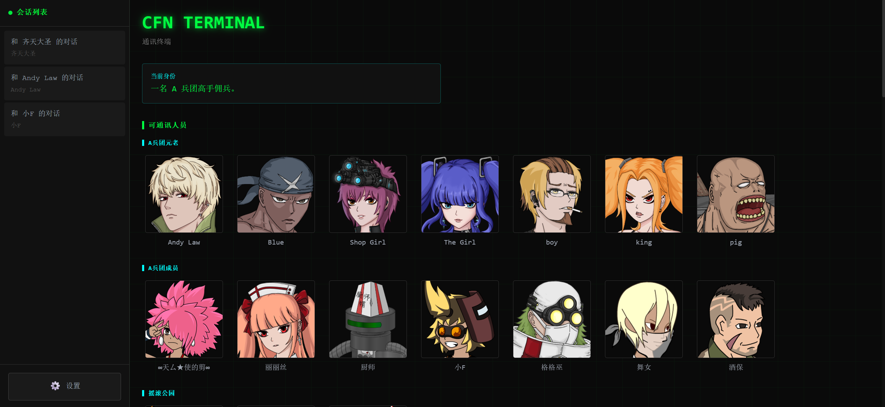

# CFN-RAG Backend（cfn-rag-backend）

[](https://opensource.org/licenses/MIT)

CFN-RAG 后端是一个面向 [Crazy Flash Night (CFN)](https://github.com/FlashNightModReborn/CrazyFlashNight) 的 **NPC 角色扮演对话 + 游戏数据 RAG + 任务生成/协商/写入Agent** 服务。它读取 CFN 的 `resources` 资源数据，通过检索增强生成（RAG）使得NPC能够理解游戏世界设定、角色背景、任务信息等内容，并通过一套“工具调用 + 校验管线 + 原子写入”的流程，在对话中生成可被游戏加载的委托任务（写入 `agent_tasks.json` / `agent_text.json`）。

前端终端界面为独立仓库：[cfn-terminal-web](https://github.com/aka-flashNight/cfn-terminal-web)。

## 预览



## 功能特点

- **RAG 检索智能对话**：基于游戏数据进行多路 Dense + BM25 + Hybrid RRF 检索，覆盖角色、任务、物品、世界观等各类话题
- **Supervisor 多 Agent 系统**：LangGraph Supervisor 智能路由到 QueryAgent（查资料）/ TaskAgent（发任务）/ DialogueAgent（闲聊），每种 Agent 只持有自己需要的工具
- **Skills 渐进式披露**：Skills（流程知识包）与 Tools（原子函数）解耦，三级按需加载（简表 → 正文 → 附件），大幅降低 prompt token 消耗
- **流式回复（SSE）**：支持流式输出，前端可做打字机效果；多 Agent 场景下 Supervisor 可选 `interim_reply` 中途过渡对话
- **NPC 分层记忆系统**：按会话保存对话历史与摘要，保持上下文连贯；LLM prompt 分层设计最大化前缀缓存命中率
- **好感度 / 关系 / 情绪**：维护 NPC 独立状态，并支持工具化更新
- **多模态对话**：可注入 NPC 立绘/头像（WebP/PNG），增强角色扮演一致性
- **对话管理**：支持删除、重命名会话，分页加载历史记录；HITL 任务确认/取消/讨价还价
- **向量索引持久化**：本地和 Qdrant 两种向量后端可选，启动无需重建
- **Agent 任务生成系统（端到端）**：
  - 在对话中先生成 **任务草案（draft）**，并可多轮 **讨价还价/局部修改/重新发布或取消**
  - 用户确认后 **原子写入** CFN 任务文件（`agent_tasks.json` 与 `agent_text.json`）
  - 全流程带 **后端校验管线**（物品/关卡/进度/价值预算/等级匹配等）
- **RAG 评估体系**：Ragas 端到端评估（faithfulness / answer_relevancy / context_precision / context_recall）+ 检索层独立评估（recall@k / MRR / nDCG），dense / BM25 / hybrid RRF 三轨对比
- **双 Profile 云原生**：**Local**（双击 exe，零外部依赖）/ **Server**（Docker + K8s + Redis + Qdrant + Postgres + arq Worker）
- **可执行文件打包发布**：提供 PyInstaller 打包的单文件版与完整独立版

## 前置要求

CFN-RAG 后端需要配合 **Crazy Flash Night 游戏资源** 使用。请将游戏项目的 `resources` 文件夹与本项目放在同一目录层级（或通过环境变量 `CFN_RESOURCES_DIR` 指定路径）：

```
父目录/
├── resources/              # Crazy Flash Night 游戏资源文件夹
│   ├── data/
│   └── ...
└── cfn-rag-backend/        # 本项目
    ├── launcher.py
    └── ...
```

Crazy Flash Night 游戏项目地址：`https://github.com/FlashNightModReborn/CrazyFlashNight`

## 架构概览

### Supervisor 多 Agent 编排

```
UserMsg → Supervisor → QueryAgent（查资料 / 知识检索）
                     → TaskAgent（发任务 / 协商 / 确认写入）
                     → DialogueAgent（流式闲聊 / 最终回复）
                     → finalize → END
```

- **Supervisor**：轻量路由节点（非流式），输出 `next_agent ∈ {query, task, dialogue, end}` + 可选 `interim_reply`（≤40 字中途过渡对话），不携带非必要工具 schema
- **QueryAgent**：持有 `search_knowledge / search_items / search_stages` + Skills 元工具，上限 3 轮决策，输出检索结果供下游复用
- **TaskAgent**：持有 `prepare_task_context → draft_agent_task → update_task_draft → confirm_agent_task / cancel_agent_task` 状态机，上限 4 轮；确认写入前触发 HITL 中断
- **DialogueAgent**：携带 `update_npc_mood` 单一工具 + `stream=True`，单次流式调用产出最终 NPC 对话
- **防护机制**：per-agent 调用上限、连续失败黑名单、token 预算熔断器（circuit breaker）、全局 6 轮强制出口——配置在 `route` 工具 schema 中，不依赖 prompt 自觉

### Tools / Skills 分离 + 渐进式披露

遵循 Anthropic 2026 Agent Skills 规范：

- **Tools**：原子函数（OpenAI function calling），每个 tool 一个文件，位于 `services/tools/{category}/{name}.py`
- **Skills**：人类可读的流程知识包，YAML frontmatter + Markdown body，位于 `services/skills/{name}/SKILL.md`
- **三级加载**：Level 1 `list_skills` 只返回所有 skill 的 name + description 简表；Level 2 `read_skill(name)` 加载完整正文；Level 3 `read_skill_file(name, file)` 加载 references/ 附件
- 各 Worker Agent 按职责持有 skill 子集（如 TaskAgent 加载 `task-publishing` + `task-bargaining`，DialogueAgent 不加载），实现 prompt 最小化

### 双 Profile 部署模式

| | Local Profile | Server Profile |
|------|------|------|
| 启动方式 | `python main.py` / 双击 exe | Docker / K8s |
| 缓存 | In-Memory dict | Redis |
| 数据库 | SQLite | PostgreSQL |
| 向量库 | LlamaIndex 本地索引 | Qdrant |
| Checkpointer | AsyncSqliteSaver | AsyncPostgresSaver |
| 后台任务 | — | arq Worker |
| 观测性 | 控制台日志 | Prometheus /metrics + JSON 日志 |
| 外部依赖 | 零 | Redis + Qdrant + Postgres |

`launcher.py` 内置前端静态服务器还承担了**本地反向代理层**：浏览器侧统一请求同源地址，前端服务将 `/api/*` 转发到后端 `127.0.0.1:7077`，并对 `text/event-stream` 响应做**流式转发**，以同时解决本地跨域与流式响应兼容问题。

**核心代码入口**

| 职责 | 路径 |
|------|------|
| Supervisor 主图 + Checkpointer | `services/agents/graph.py`、`checkpointer.py` |
| 三个 Worker Agent 子图 | `services/agents/workers.py` |
| 多 Agent 共享状态 | `services/agents/state.py` |
| 原子工具（BaseTool + ToolRegistry） | `services/tools/base.py` |
| Skills 注册表 + SKILL.md 解析 | `services/skills/base.py` |
| Profile 配置 + 后端自动推导 | `core/config.py` |
| 存储抽象（Cache / DB / Vector） | `services/storage/` |
| 任务草案 SQLite / PG | `services/task_draft_store.py`、`services/storage/postgres_db.py` |

## 任务生成系统（草案 → 协商 → 写入）

### 硬约束：可写文件

**仅允许**后端修改以下两个文件（原子写入，避免半截 JSON）：

- `resources/data/task/agent_tasks.json`
- `resources/data/task/text/agent_text.json`

其余 `task/*.json`、`task/text/*.json`、物品/关卡等数据 **只读**，供检索与校验。

### 两步式 + 协商 + 确认

任务发布遵循“**两步式工具调用** + **校验** + **草案持久化** + **确认写入**”流程：

1. **准备上下文**：`prepare_task_context(task_type, reward_types)`  
   后端基于玩家进度/等级、NPC、商店/切磋能力等，从 `GameDataRegistry` 筛选关卡/物品/奖励候选与规则说明（详见 `data_files_overview.md`）。
2. **生成草案**：`draft_agent_task(...)`  
   LLM 输出结构化草案（`item_name`+`count` 等，由后端拼接为游戏所需的 `"物品名#数量"`），**全量校验**通过后按 `session_id` 写入 SQLite 草案表。
3. **协商修改**：`update_task_draft(draft_id, modify_fields)`  
   仅替换 `modify_fields` 中出现的顶层字段；后端对变更字段做**增量校验**（`task_type` / `get_requirements` 等不可通过此工具改类型时需重新走 1+2）。
4. **确认发布**：`confirm_agent_task(draft_id, description, get_dialogue, finish_dialogue, ...)`  
   合并任务标题、任务说明与对话后再次校验，通过后分配任务 ID，并写入上述两个 agent 文件。
5. **取消**：`cancel_agent_task(draft_id, ...)`

辅助工具：**`search_knowledge`**（RAG 检索）、**`update_npc_mood`**（好感/情绪）。部分工具支持可选 **`ui_hint`（≤12 字）** 供前端/SSE 展示进度提示。

### `task_type` 枚举（12 种）

与 `services/agent_tools/schemas.py` 中 `TASK_TYPES` 一致：

`问候`、`传话`、`通关`、`清理`、`挑战`、`切磋`、`资源收集`、`装备缴纳`、`特殊物品获取`、`物品持有`、`通关并收集`、`通关并持有`。

### 校验管线（后端拦截范围摘要）

`services/agent_tools/validator.py` 对草案/更新/确认执行多项校验，主要包括：**物品是否存在**、**数量是否合理**、**关卡是否存在且解锁条件不超玩家进度**、**副本难度与 mercenary/challenge 规则**、**前置任务 ID 合法且禁止 `-1`**、**奖励总价值是否在预算区间**、**奖励类型与 NPC 商店/既有任务池等合规性**、**装备等级与当前阶段上限匹配**等。未通过时返回结构化错误，由模型修正后重试。
### Prompt 缓存命中优化

主流LLM API 服务会对「与历史请求相同前缀」的输入 token 计为 **缓存命中（Cached tokens）**，在控制台与账单中与未命中部分区分计价。

在本项目的一次典型「多轮工具 + 最终流式回复」链路中（以 Kimi K2.5 实测为例）实测：

| 阶段 | 缓存命中表现（示例） |
|------|----------------------|
| **工具决策轮** | 输入 token **命中率多在 95%+** |
| **最终生成轮** | 输入 token **命中率约 85%～95%** |


> 完整规则与字段说明见仓库根目录 `data_files_overview.md`。

## 快速开始

### 方式一：使用预编译的可执行文件（推荐有游戏项目或下载过一次独立版的用户）

1. 从 [Releases](https://github.com/aka-flashNight/cfn-rag-backend/releases) 页面下载 `CFN-RAG.exe`
2. 确保 `resources` 文件夹与 `CFN-RAG.exe` 在同一目录
3. 双击运行 `CFN-RAG.exe`
4. 浏览器将自动打开界面

**注意**：必须配合`resources`游戏项目文件夹，且是github上的最新版本


### 方式二：使用完整独立版（推荐无游戏项目且首次下载的用户）

适合没有下载游戏项目，但想体验功能的用户。

1. 从 [Releases](https://github.com/aka-flashNight/cfn-rag-backend/releases) 页面下载 `CFN-RAG-Full.zip`
2. 解压到任意位置
3. 双击运行 `CFN-RAG.exe`
4. 浏览器将自动打开界面

**优点**：无需额外下载游戏资源，独立运行
**注意**：内置资源可能不是最新版本

### 方式三：从源码运行（推荐开发者）

#### 环境要求

- Python 3.8+
- 足够的磁盘空间（约 500MB 用于依赖和模型）

#### 安装步骤

1. 克隆仓库

```bash
git clone https://github.com/aka-flashNight/cfn-rag-backend.git
cd cfn-rag-backend
```

2. 创建虚拟环境

```bash
python -m venv venv

# Windows
venv\Scripts\activate

# Linux/macOS
source venv/bin/activate
```

3. 安装依赖

```bash
pip install -r requirements.txt
```

4. 下载嵌入模型（可选，首次运行会自动下载）

```bash
# 使用国内镜像（推荐）
python scripts/download_model.py --modelscope

# 或使用 HuggingFace 镜像
python scripts/download_model.py --mirror

# 或使用代理
python scripts/download_model.py --proxy http://127.0.0.1:10809
```

5. tools 目录（可选，未随仓库提供）

本仓库**不包含** `tools` 目录（未上传至 GitHub）。仅当需要使用「从 SWF 导成立绘」功能时，需在项目根目录下创建 `tools` 文件夹并放入以下内容：

| 内容 | 说明 |
|------|------|
| **ffdec.jar** | 主程序。从 [JPEXS Free Flash Decompiler Releases](https://github.com/jindrapetrik/jpexs-decompiler/releases) 下载 `ffdec_*.zip`，解压后将其中的 `ffdec.jar` 或 `ffdec_<版本>.jar` 放入 `tools`（可重命名为 `ffdec.jar`） |
| **lib/** | 依赖库。官方 ZIP 内与 ffdec.jar 同级的 `lib` 文件夹**需一并**复制到 `tools` 下，保持 `tools/lib/` 与 `tools/ffdec.jar` 同级，否则 `java -jar` 无法解析 Class-Path |
| **运行环境** | 本机需安装 **JRE**，并将 `java` 加入 PATH 或配置 `JAVA_HOME` |

不需要此功能时可跳过。

6. 配置 API Key

复制 `.env` 文件并配置你的 API Key：

```bash
cp .env.example .env
# 编辑 .env 文件，填入你的 API Key
```

7. 启动服务

```bash
python launcher.py
```

## 发布版本说明

我们在 [Releases](https://github.com/aka-flashNight/cfn-rag-backend/releases) 页面提供以下两种发布包，请根据你的需求选择：

### 1. CFN-RAG-Full.zip（完整独立版）

**面向人群**：首次下载，想独立体验功能，不想下载完整游戏项目的用户

| 特点 | 说明 |
|------|------|
| 文件大小 | 约 400MB（含必要的资源文件） |
| 使用方式 | 解压到任意位置，进入文件夹运行 `CFN-RAG.exe` |
| 依赖 | 无需外部 `resources` 文件夹，无需 Python 环境 |
| 优点 | 完全独立运行，不依赖游戏项目 |
| 缺点 | 无法随游戏更新获取最新数据，仅包含基础资源 |

**目录结构**：
```
任意位置/
├── resources/                  # 包含必要的游戏数据文件
└── CFN-RAG.exe                 # 单文件可执行程序
```

---

### 2. CFN-RAG.exe（单文件版）

**面向人群**：有完整游戏项目，或已下载过完整版的用户

| 特点 | 说明 |
|------|------|
| 文件大小 | 约 300MB |
| 使用方式 | 将 `CFN-RAG.exe` 放到与 `resources` 文件夹同一目录，双击运行 |
| 依赖 | 需要游戏项目 `resources` 文件夹，无需 Python 环境 |
| 优点 | 单个文件，下载即用，移动方便 |
| 缺点 | 必须配合 `resources` 文件夹，且是github上的最新版本 |

**目录结构**：
```
你的游戏目录/
├── resources/              # 游戏资源文件夹
└── CFN-RAG.exe            # 单文件可执行程序
```

---

### 版本选择建议

| 你的情况 | 推荐版本 |
|---------|---------|
| 首次体验，没有游戏项目，想独立体验功能 | **CFN-RAG-Full.zip** |
| 有游戏项目，想体验完整功能/已下载过Full压缩包 | **CFN-RAG.exe** |
| 开发者，需要修改代码 | **源码克隆** |

## 配置说明

### 获取 API Key

本项目需要配置 LLM API Key 才能使用。如需临时体验，以下是几种获取免费 API Key 的方式：

#### ModelScope 魔搭社区（国内访问稳定，可试用）

ModelScope 提供每日刷新的免费额度，单模型20~500 次，总共 2000 次，足以支持聊天体验。单个模型达到额度后可切换其他模型名称，但不要过于频繁的使用。

**获取步骤**：

1. **注册并绑定阿里云实名账户**
   - 访问 [ModelScope 官网](https://www.modelscope.cn/) 注册账号
   - 进入[账号绑定页面](https://www.modelscope.cn/my/settings/account)，绑定阿里云实名认证的账号（必须先完成阿里云实名认证）

2. **获取 API Key（访问令牌）**
   - 进入 [访问控制 - 访问令牌](https://modelscope.cn/my/access/token) 页面
   - 点击 "创建新的访问令牌"作为api_key

3. **选择模型并获取配置信息**
   - 进入 [模型库](https://www.modelscope.cn/models)
   - 在筛选条件中勾选 **"支持体验" → "推理 API-Inference"**，筛选出支持免费 API 调用的模型
   - 点击感兴趣的模型进入详情页
   - 在"推理 API" 或 "代码范例" 标签页中查看：
     - `model`：模型名称（如 `moonshotai/Kimi-K2.5`）
     - `base_url`：API Base地址（固定为 `https://api-inference.modelscope.cn/v1`）

**推荐模型**：
- `moonshotai/Kimi-K2.5`：Moonshot 的 Kimi K2.5 多模态模型，性能优秀，每日约50次免费调用次数（2026.3.11测试）
- `Qwen/Qwen3.5-397B-A17B`：阿里 Qwen3.5 多模态moe大模型，每日约100次免费调用次数（2026.3.11测试）
- `MiniMax/MiniMax-M2.5`：纯文本生成模型，每日约100次免费调用次数（2026.3.11测试）
- `ZhipuAI/GLM-5`：智谱文本生成模型，参数最大（但可能稍慢），每日约100次免费调用次数（2026.3.11测试）
- `deepseek-ai/DeepSeek-V3.2`：DeepSeek文本生成模型，参数大，每日约20次免费调用次数（2026.3.11测试）
- `Qwen/Qwen3.5-27B`：阿里 Qwen3.5 多模态模型，参数较小的版本，每日约**500**次免费调用次数（2026.3.11测试）
- `Qwen/Qwen3.5-122B-A10B`：阿里 Qwen3.5 多模态模型，参数中等的moe版本，每日约200次免费调用次数（2026.3.11测试）

**免费额度**：绑定阿里云实名账户后，每日 2000 次免费调用（单模型上限 500 次，部分模型可能更少，达到上限后可更换模型，但不要过于频繁的使用）。

**配置示例**：
```env
LLM_API_KEY=your_modelscope_token_here
LLM_API_BASE=https://api-inference.modelscope.cn/v1
LLM_MODEL_NAME=moonshotai/Kimi-K2.5
```

#### Google Gemini（免费额度充足，需代理）

1. 访问 [Google AI Studio](https://aistudio.google.com/app/apikey)
2. 使用 Google 账号登录
3. 点击 "Create API Key"
4. 复制生成的 Key 到 页面的设置之中，或 `.env` 文件中

**免费额度**：gemini-3.1-flash-lite-preview 每日500次请求额度，完全满足个人使用需求。

**注意**：使用 Gemini 可能需要配置代理，请参考下方代理配置部分。

#### 其他推荐平台

- **[Moonshot AI](https://platform.moonshot.cn/)**：月之暗面 Kimi API，注册有15元免费额度（可能限时）
- **[QWEN](https://bailian.console.aliyun.com/cn-beijing/?tab=model#/api-key)**：阿里云百炼 QWEN API，每个模型百万token免费额度

### 配置文件说明

创建 `.env` 文件，参考以下配置：

```env
# LLM 配置（默认使用 Gemini）
LLM_API_KEY=your_api_key_here
LLM_API_BASE=https://generativelanguage.googleapis.com/v1beta/openai
LLM_MODEL_NAME=gemini-3.1-flash-lite-preview

# 或使用其他 OpenAI 兼容的 API
# LLM_API_BASE=https://api-inference.modelscope.cn/v1
# LLM_MODEL_NAME=Qwen/Qwen3.5-397B-A17B
```

### 代理配置

**如果你使用国外模型（如 Gemini、OpenAI）或开启了全局代理，需要在前端界面中配置代理。**

代理配置已集成到前端界面中，启动服务后，在前端界面的设置区域填写代理地址即可，例如：
- `http://127.0.0.1:7890`（Clash 默认端口）
- `http://127.0.0.1:10809`（v2rayN 默认端口）
- `http://127.0.0.1:1080`（Shadowsocks 默认端口）

配置后，代理会立即生效，对后续所有 LLM API 调用及网络请求生效。

### 立绘包（可选）

为获得更好的多模态对话体验，需要将 NPC 立绘放入 `resources/flashswf/portraits/illustration` 目录。支持以下三种方式：

#### 方式一：立绘拓展包 illustration.zip（推荐）

1. 下载立绘拓展包 **illustration.zip**
2. 将 **illustration.zip** 与 **CFN-RAG.exe** 放在**同一目录**
3. 启动程序后在页面上点击立绘生成，会自动解压到 `resources/flashswf/portraits/illustration`，无需 Java，解压很快

也可手动解压：将 zip 内的立绘图片（WebP 或 PNG）解压到 `resources/flashswf/portraits/illustration` 目录下。

#### 方式二：从 SWF 导成立绘（需 Java 与 tools）

若你有游戏资源中的 SWF 立绘（位于 `resources/flashswf/portraits/*.swf`），且本机已安装 **JRE**、项目 **tools** 目录下已放置 **ffdec.jar**（JPEXS FFDec 完整版），可在前端或通过接口触发「从 SWF 导成立绘」。导出结果为 **WebP** 格式（约 0.85 质量），约需数分钟，请耐心等待。

#### 方式三：自行准备图片

将立绘图片（WebP 或 PNG）直接放入 `resources/flashswf/portraits/illustration` 目录。

**文件命名与格式**：

| 项目 | 说明 |
|------|------|
| 文件名格式 | `{NPC名称}#{情绪}.webp`（推荐）或 `.png`，例如：`凯特#普通.webp`、`凯特#开心.webp` |
| 文件格式 | WebP（推荐，体积小）/ PNG（兼容） |
| 文件大小 | 建议控制在 1M 以内，过大的图片会消耗大量 Token |

**情绪标签**：需与 NPC 拥有的情绪一致；至少提供 `普通`，其余如 `微笑`、`严肃`、`悲伤`、`愤怒` 等按需制作。若请求的情绪无对应文件，会自动回退到 `普通`；若仍无立绘，会尝试使用 `profiles` 目录下的头像。

**目录结构示例**：
```
resources/
└── flashswf/
    └── portraits/
        ├── illustration/           # 立绘目录（zip 解压或 SWF 导出/手动放置）
        │   ├── Andy Law#普通.webp
        │   └── Andy Law#微笑.webp
        └── profiles/               # 头像目录（游戏自带）
            └── Andy Law.png
```

**说明**：立绘不是必须的，没有时对话功能仍可正常使用，仅多模态体验会降级为使用头像或纯文本。


## 评估体系（Ragas + 检索层）

正式评估资产位于 `evals/`（与临时脚本用的 `test/` 区分）。两条轨道**指标含义不同，勿混用**：

| 轨道 | 评什么 | 典型指标 | 是否调用 LLM |
|------|--------|----------|----------------|
| **Retriever** | 给定 query，是否召回到标注相关的 chunk（`node_id`） | recall@k、precision@k、MRR@10、nDCG@10；`dense` / `bm25` / `hybrid_rrf` 对比 | 否 |
| **RAG（Ragas）** | 检索 + 生成整体质量 | faithfulness、answer_relevancy、context_precision、context_recall | 是（Judge） |


**准备 golden 集**（需已构建向量索引）：

```bash
pip install -r requirements.txt
python -m evals.runners.build_golden_set --tiny    # 5 条微型集 -> evals/datasets/tiny_golden.jsonl
python -m evals.runners.build_golden_set --full    # 约 80 条 -> evals/datasets/golden_v1.jsonl
```

`build_golden_set` 会从 `resources/data/rag/npc_state_db.json` 读取阵营，**排除「彩蛋」「成员」** 阵营 NPC 的对话与任务样本，避免 golden 过多非典型台词。

**运行评估**：

```bash
# 仅检索层（无 API 费用）
python -m evals.runners.run_all --suite retriever --dataset evals/datasets/tiny_golden.jsonl --sample 0

# Ragas（需可用的 Judge LLM；见下方 API Key 说明）
python -m evals.runners.run_all --suite rag --dataset evals/datasets/tiny_golden.jsonl --sample 5
```

`run_all` 默认 `--dataset` 为 `evals/datasets/golden_v1.jsonl`（全量约 130 条）；上例显式指定 `tiny_golden.jsonl`（5 条）便于调试。

报告输出到 `evals/reports/`（时间戳 + git 短 hash）。详见 [evals/README.md](evals/README.md)。

**示例（`tiny_golden.jsonl`，5 条；开发机一次运行）**：检索层三种模式总体 recall@10=1.0；Ragas 需在配置 `LLM_API_KEY` 后运行 `run_all --suite rag` 生成 `evals/reports/rag_*.md` 查看 faithfulness 等分数。


## 项目结构

```
cfn-rag-backend/
├── api/                         # API 路由层
│   ├── assets_api.py
│   └── game_api.py
├── ai_engine/
│   ├── game_data_loader.py      # 向量索引构建与缓存（Dense）
│   └── bm25_retrieval.py        # BM25 + Hybrid RRF（稀疏 + 融合检索）
├── evals/                       # 正式评估体系
│   ├── datasets/                # golden 测试集（tiny / full）
│   ├── retriever/               # 检索层评估（recall@k / MRR / nDCG）
│   ├── rag/                     # Ragas 端到端评估（faithfulness / relevancy）
│   ├── runners/                 # 评估入口（build_golden_set / run_all）
│   └── reports/                 # 评估报告（时间戳 + git hash 命名）
├── core/
│   ├── config.py                # Profile 系统 + 后端自动推导（CFN_PROFILE）
│   ├── exceptions.py
│   └── startup.py               # 启动初始化（模型/索引/数据预加载）
├── deploy/                      # 云原生部署（路线四）
│   ├── README.md                # 部署指南（Docker / minikube / Helm）
│   ├── Dockerfile               # 多阶段构建（CPU-only）
│   ├── docker-compose.yml       # 全栈 Compose（backend + worker + Redis + Qdrant + PG）
│   ├── k8s/base/                # K8s 清单（Deployment / HPA / Ingress / ConfigMap / Secret）
│   └── helm/cfn-rag/            # Helm Chart（values.yaml 分环境）
├── worker/                      # 后台 Worker（arq）
│   ├── main.py                  # Worker 启动入口
│   ├── tasks.py                 # 任务定义（重建索引 / 评估触发 / 健康检查）
│   └── settings.py              # Redis broker 配置
├── loadtest/                    # 压测（Locust）
│   └── locustfile.py            # 50 并发 SSE 流式 + 非流式压测脚本
├── alembic/                     # Postgres 数据库迁移
│   ├── env.py
│   └── versions/001_initial.py
├── dist/                        # 前端构建产物（静态）
├── models/                      # 嵌入模型落盘目录
│   └── bge-small-zh-v1.5/       # 默认 BGE 中文嵌入（384 维）
├── schemas/                     # Pydantic 请求/响应模型
├── scripts/
│   ├── build_exe.py
│   ├── download_model.py
│   ├── extract_portraits_from_swf.py
│   ├── migrate_sqlite_to_pg.py         # SQLite → Postgres 迁移
│   └── migrate_vector_to_qdrant.py     # LlamaIndex 本地索引 → Qdrant 迁移
├── services/
│   ├── game_rag_service.py      # RAG 编排（多路检索 + Agent/非Agent 对话入口）
│   ├── llm_client.py            # LLM 调用（OpenAI 兼容，含流式）
│   ├── memory_manager.py        # SQLite 会话记忆 + 摘要
│   ├── npc_manager.py           # NPC 状态（好感度/情绪/阵营）
│   ├── task_draft_store.py      # 任务草案 SQLite 存储（local profile）
│   ├── session_heartbeat.py     # SSE 连接 Redis 心跳续期（server profile）
│   ├── latency_tracker.py       # 首字延迟分步检测
│   ├── agents/                  # 多 Agent Supervisor（路线三）
│   │   ├── graph.py             # 主图编译 + Checkpointer 集成
│   │   ├── checkpointer.py      # Checkpointer Profile 工厂（Local→Sqlite / Server→PG）
│   │   ├── supervisor.py        # Supervisor 路由节点
│   │   ├── workers.py           # Query / Task / Dialogue 三个 Worker 子图
│   │   ├── state.py             # SupervisorState 定义
│   │   └── tool_scopes.py       # 各 Worker 工具白名单
│   ├── agent_graph/             # 单 Agent 图（保留为回退路径）
│   ├── tools/                   # 原子工具（OpenAI function calling）
│   │   ├── base.py              # BaseTool / ToolRegistry / ToolContext
│   │   ├── query/               # search_knowledge / search_items / search_stages
│   │   ├── task/                # prepare / draft / update / confirm / cancel
│   │   ├── mood/                # update_npc_mood
│   │   └── system/              # list_skills / read_skill / read_skill_file
│   ├── skills/                  # Anthropic 2026 规范 Skills（YAML frontmatter + Markdown body）
│   │   ├── base.py              # Skill / SkillRegistry
│   │   ├── task-publishing/     # 任务发布完整流程 + references/（奖励规则 / 任务类型）
│   │   ├── task-bargaining/     # 讨价还价协商流程
│   │   ├── knowledge-search/    # 知识检索工具协同用法
│   │   ├── mood-tracking/       # 情绪追踪调用时机
│   │   └── skill-discovery/     # 元工具用法
│   ├── storage/                 # 存储抽象层（路线四）
│   │   ├── cache.py             # CacheBackend Protocol + MemoryCache / RedisCache
│   │   ├── db.py                # SessionStore / MessageStore / DraftStore Protocol + SqliteBackend
│   │   ├── vector.py            # VectorBackend Protocol + LlamaIndexLocalBackend
│   │   ├── qdrant_vector.py     # QdrantBackend（server profile）
│   │   └── postgres_db.py       # PostgresBackend（server profile）
│   ├── agent_tools/             # 业务纯函数（供 tools/ 调用）
│   │   ├── schemas.py           # 参数 Schema / 任务类型 / 难度 / 奖励常量
│   │   ├── context_builder.py   # prepare_task_context 数据筛选
│   │   ├── validator.py         # 全量/增量校验管线
│   │   ├── task_tools.py        # 草案/确认/取消业务逻辑
│   │   └── draft_formatting.py  # 草案格式化
│   └── game_data/               # 游戏静态数据 Registry
├── launcher.py
├── main.py                      # FastAPI 入口 + Prometheus /metrics + structlog
└── requirements.txt
```

## MCP Server（游戏数据查询）

项目附带一个 [MCP (Model Context Protocol)](https://modelcontextprotocol.io/) Server（`mcp_server/`），将游戏数据的查询能力以标准协议暴露给 Claude Desktop、Cursor 等 AI 工具。

**提供的功能**：
- **13 个查询工具**：物品搜索与详情、关卡搜索与掉落查询、合成配方搜索、NPC 商店、任务查询等
- **9 个数据资源**：以 `game://items/{name}`、`game://stages/{area}` 等 URI 暴露结构化游戏数据
- **3 个 Prompt 模板**：辅助任务设计和 NPC 对话创作

**使用方式**：
```bash
pip install fastmcp
fastmcp install mcp_server/server.py    # 安装到 Claude Desktop
fastmcp dev mcp_server/server.py        # MCP Inspector 调试
```

## 打包可执行文件

如果你想自己打包可执行文件：

```bash
python scripts/build_exe.py
```

打包完成后会在项目根目录生成 `CFN-RAG.exe`。

## 常见问题

### Q: 启动时提示找不到 resources 文件夹？

A: 确保 `resources` 文件夹与项目在同一目录层级，参考上方【前置要求】部分的目录结构说明，项目目录在最上方。

### Q: 模型下载失败或很慢？

A: 使用国内镜像下载：
```bash
python scripts/download_model.py --modelscope
```

### Q: API 调用报错/无响应？

A: 检查以下几点：
1. 模型名称、API Base、API Key 是否正确配置
2. 如使用国外模型，是否配置了代理
3. 代理地址和端口是否正确

### Q: 如何更换其他 LLM 模型？

A: 在前端配置中修改（优先级最高），或者修改 `.env` 文件中的 `LLM_API_BASE` 和 `LLM_MODEL_NAME` 配置项。只要 API 兼容 OpenAI 格式即可使用。

### Q: 第一次启动后对话加载很慢，第二次就很快？

A: 这是正常现象。第一次启动时需要构建向量索引（读取所有游戏数据并计算向量），这个过程可能需要 10-30 秒。索引构建完成后会自动保存到 `resources/tools/vector_index` 目录，下次启动时会直接加载。

### Q: 游戏数据更新了，如何让索引重新构建？

A: 两种方式任选其一：  
1. **手动删除**：删除 `resources/tools/vector_index` 文件夹，下次启动时会自动重新构建索引。  
2. **接口/界面**：若前端或脚本提供了「重置知识库」功能，调用后可立即触发重建，无需重启。

### Q: 立绘图片如何获取？

A: 推荐方式：
1. **使用立绘拓展包**：下载 illustration.zip，与 exe 同目录放置，在前端点击生成立绘，程序会自动解压到立绘目录
2. **从 SWF 导出**：若有游戏 SWF 立绘且已配置 Java 与 tools/ffdec.jar，在前端或通过接口触发立绘生成（约需数分钟）
3. 自行从游戏资源提取或自行绘制后，放入 `resources/flashswf/portraits/illustration/`，文件名格式为 `NPC名#情绪.webp`（或 .png）

详见上方【立绘包】章节。

## 技术栈

| 层级 | 技术 | 说明 |
|------|------|------|
| **Web 框架** | FastAPI + Uvicorn | 异步 HTTP 服务；SSE（Server-Sent Events）流式回复；`/metrics` 端点 |
| **Agent 编排** | **LangGraph** | Supervisor + Query/Task/Dialogue 三个 Worker Agent 子图；`AsyncSqliteSaver` / `AsyncPostgresSaver` Checkpointer；HITL v2（`interrupt_before` 草案确认中断） |
| **Agent Skills** | Anthropic 2026 规范 | Skills（YAML frontmatter + Markdown body）与 Tools（OpenAI function calling）彻底解耦；三级渐进式披露（`list_skills` → `read_skill` → `read_skill_file`） |
| **RAG 检索** | **LlamaIndex** | 多路向量检索（Dense + BM25 + Hybrid RRF 融合）；Qdrant 向量数据库（server profile）；CJK 字符级分词器 |
| **LLM 调用** | OpenAI 兼容 REST | `openai` SDK，`base_url` + `model` 可指向 Gemini / Kimi / Qwen / DeepSeek / GLM 等 |
| **嵌入模型** | BAAI/**bge-small-zh-v1.5** | 本地离线 CPU 推理（HuggingFace / ModelScope），384 维 |
| **评估体系** | **Ragas** + 自定义 Retriever Eval | Ragas：faithfulness / answer_relevancy / context_precision / context_recall；Retriever：recall@k / precision@k / MRR / nDCG；dense / bm25 / hybrid RRF 三轨对比 |
| **Prompt 优化** | Prompt Caching | 分层 prompt 设计（L1 世界观 → L5 Agent 专属指令），最大化 API Cache 命中率（实测 85%-95%+） |
| **存储 — Local** | SQLite + LlamaIndex 本地索引 | `memory.db`（会话记忆 + 任务草案）；`vector_index/` 目录（向量索引持久化）；In-Memory dict 缓存 |
| **存储 — Server** | **PostgreSQL** + **Qdrant** + **Redis** | `PostgresBackend`（SQLAlchemy 2.0 async + asyncpg）；`QdrantBackend`（Cosine 384 维，metadata filter 转换）；`RedisCache`（热会话缓存 / SSE 心跳 / 幂等 / Pub-Sub 预留） |
| **后台任务** | **arq** | Redis-based 异步任务队列（索引重建 / 评估触发 / 立绘提取） |
| **容器化** | Docker + docker-compose | 多阶段构建（CPU-only 镜像 ~1.2GB）；全栈 Compose（backend + worker + Redis + Qdrant + PG + Jaeger） |
| **编排** | **Kubernetes** + **Helm** | Deployment / HPA（CPU 70% 自动扩缩 1→3）/ Ingress（nginx sticky session for SSE）/ ConfigMap / Secret；Helm Chart 分环境 values |
| **观测性** | **Prometheus** + **structlog** | `/metrics`（请求计数/延迟分布/SSE 活跃连接数）；JSON 结构化日志（server profile）；Jaeger 追踪（可选） |
| **压测** | **Locust** | 50 并发 SSE 流式 + 非流式混合场景，TTFB / 完整延迟 / 失败率 |
| **打包发布** | PyInstaller | 单文件版 exe + 完整独立版 zip；`launcher.py` 内置反向代理（本地跨域 + SSE 流式转发） |
| **本地开发** | minikube + kubectl | Windows + WSL2 + Docker Desktop 驱动，一键部署全栈 K8s 集群 |

## 许可证

本项目采用 [MIT License](LICENSE) 开源协议。

## 致谢

- [Crazy Flash Night](https://github.com/FlashNightModReborn/CrazyFlashNight) - 游戏项目
- [cfn-terminal-web](https://github.com/aka-flashNight/cfn-terminal-web) - 前端终端界面（Vue 3）
- [LlamaIndex](https://www.llamaindex.ai/) - RAG 框架
- [BAAI](https://github.com/FlagOpen/FlagEmbedding) - BGE 嵌入模型
- [LangGraph](https://github.com/langchain-ai/langgraph) - Agent 编排 + Checkpointer
- [Qdrant](https://qdrant.tech/) - 向量数据库（server profile）
- [Redis](https://redis.io/) - 缓存 / 消息队列（server profile）
- [Prometheus](https://prometheus.io/) - 监控指标采集
- [Locust](https://locust.io/) - 负载测试框架

## 联系方式

如有问题或建议，欢迎提交 [Issue](https://github.com/aka-flashNight/cfn-rag-backend/issues) 或 [Pull Request](https://github.com/aka-flashNight/cfn-rag-backend/pulls)。
